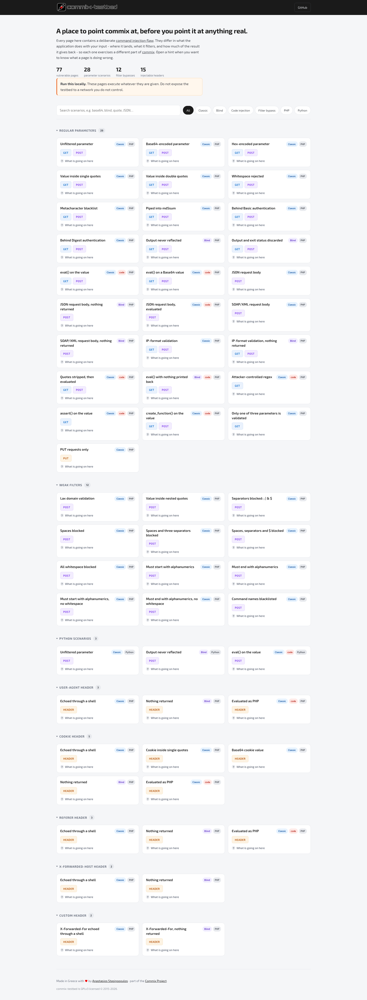

  

  
  
  
  
  

**commix-testbed** is a collection of deliberately vulnerable web pages, written by **[Anastasios Stasinopoulos](https://github.com/stasinopoulos)** (**[@ancst](https://x.com/ancst)**), used to exercise **[commix](https://github.com/commixproject/commix)**'s detection and exploitation features - and to learn what **[command](https://owasp.org/www-community/attacks/Command_Injection)** (and **[code](https://owasp.org/www-community/attacks/Code_Injection)**) injection actually looks like in code.

Every page contains the same underlying bug: a request value reaches a shell, or a string the application evaluates as code. What changes from page to page is everything around it - where the value lands, what the application does to it first, and how much of the result comes back. That is what separates an injection point you find in seconds from one that is nearly invisible, and it is why a scanner needs more than one technique.

Each scenario carries an explanation of what the code gets wrong and what the mistake teaches, so the collection reads as a tour of the bug class rather than a pile of targets.

> [!WARNING]
> **These pages execute whatever they are given.** Run the testbed locally and keep it off any
> network you do not control.
>
> It is a target, not a demo you leave running.

## Scenarios

* **Regular parameters** - `GET`, `POST` and `PUT` bodies, JSON and SOAP/XML documents, Base64 and hex encodings, single and double quoting, HTTP Basic and Digest authentication, and a page where only two of three parameters are validated.
* **Code evaluation sinks** - `eval()`, `assert()`, `preg_replace()` with an attacker-controlled pattern, `create_function()`, and `str_replace()` sanitising into an evaluated string.
* **Weak filters** - denylisted metacharacters, whitespace rejection, anchored patterns that constrain only one end, lax domain validation, and a command-name blocklist. Each one is wrong in a different way.
* **HTTP headers** - `User-Agent`, `Cookie`, `Referer` and `X-Forwarded-Host`, plus a custom `X-Forwarded-For` header read for the access log.
* **Python scenarios** - the same classic, blind and code-injection bugs written in Python and served as CGI, so a run is not only exercising PHP.
* **Every reported type** - classic and blind, command and code injection, so all four combinations commix can report are covered.

Scenarios are labelled with the type commix reports them as. See the **[techniques](https://github.com/commixproject/commix/wiki/Techniques)** wiki page for what those mean and which technique reaches each one.

## Installation

You can download commix-testbed on any platform by cloning the official Git repository :

    $ git clone https://github.com/commixproject/commix-testbed.git commix-testbed

Alternatively, you can use the [dockerized version](https://hub.docker.com/r/commixproject/commix-testbed) :

    $ docker run --rm -p 8080:80 commixproject/commix-testbed

> [!NOTE]
> **[PHP](https://www.php.net/downloads)** is required for running the testbed. There are no
> dependencies and no build step. The pages parse on everything from **5.5** to **8.x**.

Serve it with PHP's built-in server :

    $ php -S 127.0.0.1:8080

> [!NOTE]
> Most scenarios shell out to `ping`, so the host serving them needs it installed - a bare
> `php:apache` image does not have it. The **file-based** technique needs the web root to be
> writable, and the **out-of-band** technique needs the host to be able to reach the internet.
>
> Four pages need an interpreter older than PHP 8 to be *exploitable*, though they load on any
> version: `create_function()` was removed in PHP 8, the `e` regex modifier in PHP 7, and `assert()`
> stopped evaluating a string argument in PHP 8. The published image ships PHP 5.5, so every
> scenario works there.

## Usage

Open <http://127.0.0.1:8080> for the index, which lists every scenario alongside an explanation of
the flaw behind it.

Point commix at any scenario :

    $ python3 commix.py --url="http://127.0.0.1:8080/scenarios/regular/GET/classic.php?addr=127.0.0.1"

Header-based scenarios are only reached at the right `--level` - `2` covers cookies, `3` covers the
other headers :

    $ python3 commix.py --url="http://127.0.0.1:8080/scenarios/user-agent/ua(classic).php" --level=3

Where the value is evaluated as code rather than run by a shell, `--eval` names the language. In
PHP :

    $ python3 commix.py --url="http://127.0.0.1:8080/scenarios/regular/GET/eval.php?user=ancst" --eval=php

... and in Python :

    $ python3 commix.py --url="http://127.0.0.1:8080/scenarios/python/eval.py?user=ancst" --eval=python

> [!NOTE]
> A shell separator means nothing at an evaluated sink - the payload has to be valid code in the
> language doing the evaluating, which is what `--eval` settles. The Python page concatenates the
> value inside a quoted literal, and commix works that boundary out for itself.

Prove execution where the page gives nothing back, by timing :

    $ python3 commix.py --url="http://127.0.0.1:8080/scenarios/regular/POST/blind.php" --data="addr=127.0.0.1" --technique=t

... or out-of-band, where the proof arrives at a server of your own rather than in the response :

    $ python3 commix.py --url="http://127.0.0.1:8080/scenarios/regular/POST/blind.php" --data="addr=127.0.0.1" --oob

> [!NOTE]
> `--oob` uses the public `oast.fun` interactsh server by default, so interaction metadata for your
> target leaves your network. Point `--oob-server` at a self-hosted instance to keep it in-house,
> and `--oob-transport=dns` where the target can resolve a name but not reach the internet over
> HTTP.

To get an overview of commix available options, switches and/or basic ideas on how to use commix, check **[usage](https://github.com/commixproject/commix/wiki/Usage)**, **[usage examples](https://github.com/commixproject/commix/wiki/Usage-examples)** and **[filters bypasses](https://github.com/commixproject/commix/wiki/Filters-bypass-examples)** wiki pages.

## Bugs and Enhancements

For bug reports or enhancements regarding commix-testbed, please open an [issue](https://github.com/commixproject/commix-testbed/issues). A good new scenario demonstrates something the existing pages do not: a different sink, a different place the value arrives from, or a filter that fails for a reason none of the others already show.

## Links

* Testbeds guide: https://github.com/commixproject/commix/wiki/Command-injection-testbeds
* Issues tracker: https://github.com/commixproject/commix-testbed/issues
* Project site: https://commixproject.com
